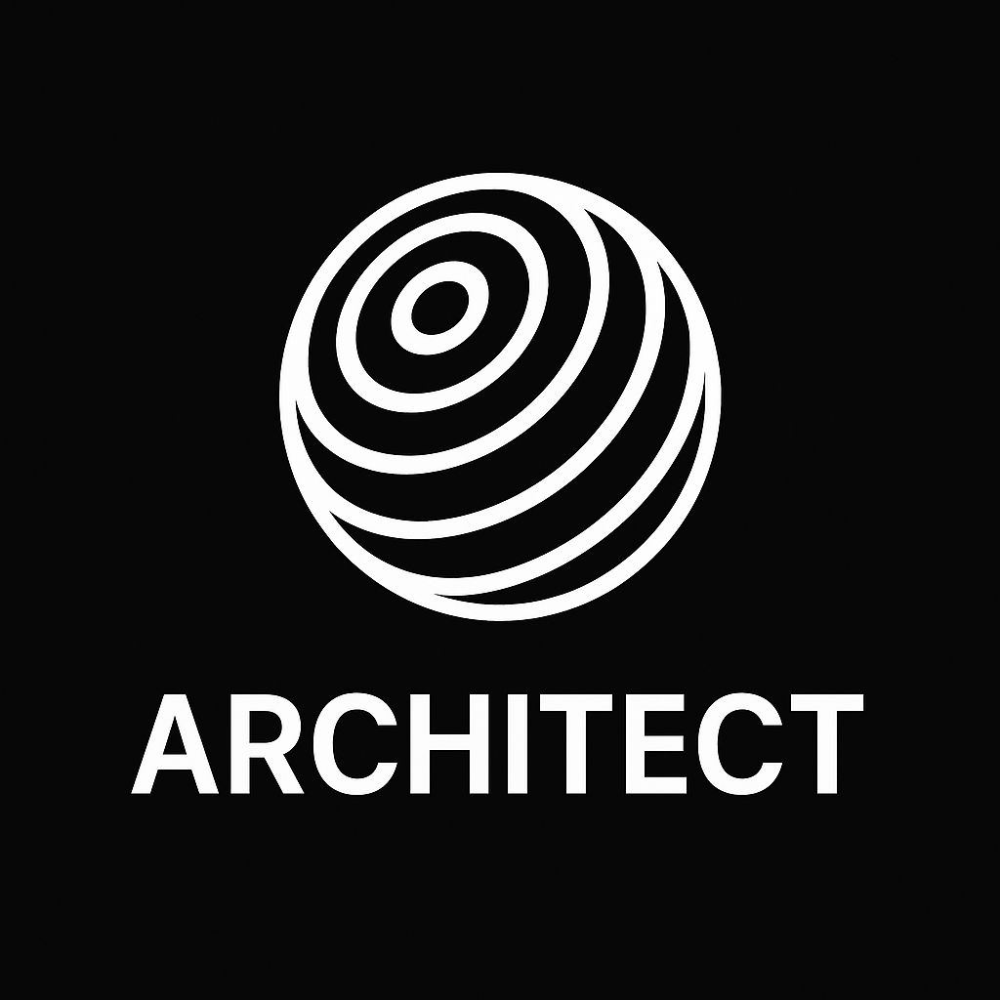

# 🧠 Architect: An Autonomous Web Research Agent

<p align="center">
  
</p>

## Overview

Architect is an autonomous AI agent system built on top of [browser-use](https://github.com/browser-use/browser-use) that performs web-based research tasks using Google's Gemini models. It combines browser automation with direct LLM queries to overcome common challenges in web research, including bot protection and rate limiting.

Unlike traditional chatbots, Architect is goal-driven. Give it a research objective, and it will:
1. Plan the necessary steps
2. Spawn specialized sub-agents for research tasks
3. Navigate websites to gather information
4. Smartly fallback to Gemini's knowledge when faced with bot protection
5. Synthesize results into coherent summaries
6. Store everything in persistent memory

## 🌟 Key Features

- **Google Gemini Integration**: Leverages Gemini 1.5 Pro for advanced reasoning and research
- **Hybrid Browser/Direct-LLM Approach**: Attempts to use real browsers first, falls back to direct LLM queries when needed
- **Bot Protection Handling**: Detects and bypasses site blocks from services like Cloudflare or aggressive bot detection
- **Modular Agent Architecture**: Includes ArchitectAgent and ResearcherAgent with more planned
- **JSON-based Memory**: All research steps and results stored in structured format for analysis
- **Playwright-based Web Interaction**: Uses modern browser automation instead of legacy Selenium approaches

## 🚀 Installation

1. Clone the repository:
```bash
git clone https://github.com/jayasuryajsk/Architect.git
cd Architect
```

2. Install the required dependencies:
```bash
pip install -e .
python -m playwright install
```

3. Create a `.env` file with your Gemini API key:
```
GEMINI_API_KEY=your-key-here
```

## 🔍 Usage

Run Architect with a research goal:

```bash
python run_architect.py --goal "Compare SpaceX and Blue Origin rocket technology"
```

This command will:
- Analyze the goal and break it into research subtasks
- Spawn a ResearcherAgent to investigate each subtask
- Try browser automation first, smartly falling back to Gemini when encountering bot protection
- Store results in `browser_use/architect/memory/memory.json`

## 🧠 Agent Architecture

### ArchitectAgent
The main coordinator that breaks down high-level goals into manageable subtasks and delegates them to specialized agents.

### ResearcherAgent
Handles web research by:
1. Creating a research plan (URLs to visit, information to extract)
2. Using browser automation to navigate and extract content
3. Falling back to direct Gemini queries when websites block automated access
4. Summarizing findings into coherent research outputs

### Coming Soon
- **CriticAgent**: Evaluates research quality and identifies gaps
- **BuilderAgent**: Creates deliverables based on research findings (documents, code, etc.)

## 🛠️ Smart Fallback System

Architect includes a sophisticated fallback mechanism that handles common web research obstacles:

1. First attempts browser automation with headless=False to reduce detection
2. Monitors for indicators of bot protection ("access denied", "page crashed", etc.)
3. When detected, gracefully falls back to direct Gemini queries
4. Maintains a consistent output format regardless of data source

This approach is particularly effective for sports sites, news outlets, and social media platforms that employ aggressive bot protection.

## 📊 Project Structure

```
browser_use/
├── architect/               # Architect-specific components
│   ├── agents/              # Agent implementations
│   ├── memory/              # Memory storage system
│   └── tools/               # LLM interface and utilities
├── agent/                   # Core agent functionality 
├── browser/                 # Browser automation components
└── ...                      # Other browser-use components
```

## 📋 Requirements

- Python 3.11+
- Google Gemini API access
- Playwright for browser automation

## 📄 License

MIT License - See LICENSE file for details.

## 🤝 Credits

- Built upon the [browser-use](https://github.com/browser-use/browser-use) framework
- Uses Google's Gemini models for reasoning and fallback research
```


